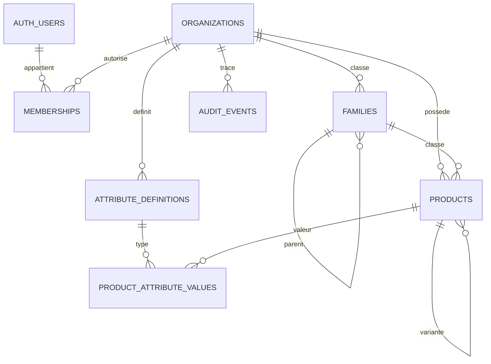

# SEMIN Studio V3.1 — proposition et réalisation

## Audit du dépôt

V1 : moteur OOXML dans `web/excel-browser.js`, import / associations / contrôle / export dans `web/ui.js`. V2 : modèle métier `catalogue-model.js`, dépôt IndexedDB `catalogue-store.js`, interface `catalogue-ui.js`. HTML autonome assemblé par `web/build.mjs`, aucune API (`connect-src 'none'`). Les 13 tests navigateur couvrent ces parcours. Le projet Python / Windows reste séparé. Pages ne publie que le HTML V2 et la licence ; le workflow V3 ne déploie rien.

Le dépôt V2 expose `read/save` pour un document entier : réutiliser ce contrat pour plusieurs utilisateurs écraserait des modifications indépendantes et ferait télécharger tout le catalogue. V3 utilise donc un dépôt par fiche, avec pagination serveur et révision par produit. Aucun fichier V1/V2 ni aucune base IndexedDB n'est remplacé. V3.1 constitue un prototype séparé dans `v3/web/`.

## Choix proposés

PostgreSQL est la source centrale ; Supabase fournit Auth (email/mot de passe), PostgREST et RLS. L'interface utilise directement leurs API HTTPS documentées, sans SDK/CDN ni framework. Les identifiants privilégiés restent exclusivement côté administration. Une clé **publique publishable** (ou ancienne `anon`) identifie le projet ; elle ne donne aucun accès au catalogue sans JWT utilisateur. Les jetons et le mot de passe ne sont jamais enregistrés dans localStorage / IndexedDB. Une actualisation demande une nouvelle connexion. Pas d'inscription publique dans l'interface ; comptes invités par un administrateur dans Supabase.

L'interface comprend connexion, choix d'espace, liste paginée, recherche SKU/EAN/désignation, filtre archivage, création, édition, archivage/restauration avec confirmation et conflits de révision. Les administrateurs peuvent attribuer les trois rôles aux comptes déjà créés ; aucun utilisateur ne peut se promouvoir. La dernière personne administratrice ne peut être rétrogradée. Les comptes Auth sont administrés depuis le tableau de bord Supabase (création, suspension, récupération, MFA).

V3 transmet volontairement les fiches saisies au projet Supabase configuré, contrairement à V2. Un avertissement l'explicite avant connexion. L'interface propose une démonstration **en mémoire** avec données fictives, sans API, distincte d'une session centrale réelle ; elle ne valide pas le fonctionnement d'un projet Supabase.

## Schéma relationnel

Tables mises en place :

| Table | Contraintes et contenu |
| --- | --- |
| organizations | Espaces séparés, UUID. Création initiale par SQL d'administration. |
| memberships | Clé espace / utilisateur Auth, rôle admin/editor/reader ; contrôle serveur. |
| families | Code unique par espace, parent du même espace ; les sous-familles sont des enfants. |
| products | UUID stable, SKU obligatoire unique insensible à la casse par espace, EAN-13 textuel nullable et unique si présent, champs de fiche, conditionnement et quantité, poids ≥ 0, statut, archivage, auteur, date et révision. |
| attribute_definitions | Code unique par espace, texte/nombre/booléen/liste/date, unité, valeurs autorisées, famille éventuelle. Fondation V3.2, pas d'écran de gestion V3.1. |
| product_attribute_values | Clé produit / attribut, même espace. Table réservée V3.2, API en lecture seule dans ce lot. |
| audit_events | Événements produits/rôles, avant/après, utilisateur, horodatage. Aucune modification/suppression autorisée aux comptes applicatifs. |

Chaque variante commercialisable ou conditionnement possède son propre SKU et son propre EAN éventuel ; `variant_of` relie au produit parent du même espace (une seule profondeur dans ce lot). L'EAN absent est NULL, jamais une valeur inventée. Les SKU/EAN restent réservés même après archivage ; restauration possible, suppression physique absente. Un même produit vendu sur deux marketplaces garde une seule identité centrale.

### Modèle prévu pour V3.3, non implémenté

`marketplaces(id, name, country)` ; `product_marketplaces(organization_id, product_id, marketplace_id, external_sku, asin, external_id, title, descriptions, attributes, publication_status, revision)` ; `marketplace_rules` versionnées ; `template_versions` (métadonnées + stockage privé des fichiers, jamais public) ; `mapping_profiles` et leurs versions ; `import_jobs`, `export_jobs`, `job_errors`. Les contraintes externes seront par espace/marketplace/identifiant non vide. Aucune règle officielle n'est inventée ; elles proviendront des templates et documents fournis.

## Sécurité côté serveur

RLS active sur toutes les tables exposées. Aucune permission pour `anon`, aucune lecture professionnelle anonyme. Lecteur : lecture des produits ; éditeur : création/édition/archivage ; administrateur : mêmes droits plus gestion des membres. Les écritures passent par RPC qui vérifient le rôle, la liste de champs, l'espace et la révision. Les fonctions `SECURITY DEFINER` ont un `search_path` vide et des noms qualifiés. Pas de permission directe INSERT/UPDATE/DELETE sur les tables par les clients, même pour les événements d'audit. Les rôles ne viennent jamais des métadonnées modifiables d'un utilisateur.

Les RPC de produit et l'audit sont transactionnels. Les modifications concurrentes sont refusées ; les champs absents d'un patch sont conservés. Archivage et restauration nécessitent une révision ; les fiches archivées sont en lecture seule. Les références famille/variante ont des clés étrangères par espace. Tests SQL réels avec JWT simulés pour les rôles, plus tests de contrat HTTP ; l'authentification Supabase hébergée reste à vérifier après configuration.

La déconnexion efface la session de l'interface et demande la révocation des jetons de rafraîchissement. Un JWT d'accès déjà émis peut rester valide jusqu'à son expiration : ne pas promettre son invalidation immédiate après déconnexion ou suspension Auth. Les rôles sont relus côté serveur à chaque commande. Pour retirer immédiatement tout accès aux fiches, l'administrateur de base peut retirer les appartenances de cet utilisateur, en préservant un autre administrateur ; les données déjà consultées ne peuvent pas être retirées d'un appareil. La durée des JWT et la révocation des comptes sont à valider avec la DSI.

GitHub Pages peut héberger une interface publique, mais jamais une base ni des sauvegardes. Sa sécurité ne dépend pas de cacher l'URL : elle repose sur Auth et PostgreSQL. Projet HTTPS fixé par le build et CSP `connect-src` limitée à cet hôte, aucune URL d'image distante chargée. Pas de données dans les paramètres d'URL, télémétrie ou cache applicatif. Auth et RPC utilisent `credentials: 'omit'` et aucune journalisation des jetons. Toute session centrale nécessite Internet ; aucun mode hors ligne central ni synchronisation implicite.

## Services, coûts et configurations

- Deux projets Supabase distincts : développement (fictif uniquement) et production (après validation DSI), idéalement organisations et accès administratifs séparés. PostgreSQL, Auth et API dans la région choisie par la DSI. Les noms de projets ne doivent pas inclure de secret.
- Supabase propose une offre gratuite limitée et des offres payantes. Quotas, mise en veille, rétention des sauvegardes, restauration ponctuelle, egress, MFA/SSO et conditions contractuelles dépendent du plan. **Aucun tarif garanti ici** : consulter [la tarification officielle](https://supabase.com/pricing) avant création. Aucun projet ni abonnement n'a été créé par ce travail.
- GitHub Pages convient au prototype si la DSI accepte une interface publique ; le dépôt ne contient que le code et les tests fictifs. Éviter les clés privilégiées, exports, backups, catalogues, emails réels et fichiers commerciaux dans GitHub/Actions.
- Pour inviter/récupérer les comptes en production, prévoir SMTP entreprise configuré dans Supabase (coût éventuel), URLs de redirection autorisées et délivrabilité. Limiter les comptes, désactiver les inscriptions publiques, appliquer MFA et revoir les sessions selon la politique DSI.
- Une production nécessite également DPA/RGPD, localisation, rétention/suppression, audits, MFA, sauvegardes restaurées en exercice et révocation des comptes. Cela reste une validation externe, pas une garantie fournie par les tests du prototype.

## Migration et retour arrière

Ne jamais supprimer automatiquement V2 ni son stockage. Lot V3.1 ne lit ni ne transfère les sauvegardes V2. V3.2 ajoutera une prévisualisation JSON V2 : attributs connus et personnalisés, correspondance UUID anciens vers nouveaux si UUID non standard, conflits SKU/EAN, révision, modifications sélectionnées, rapport et confirmation. Les valeurs existantes et zéros initiaux seront conservés, aucun EAN inventé. Les statuts manuels V2 ne seront pas confondus avec une publication marketplace.

Avant migration : télécharger et vérifier une sauvegarde JSON V2, sauvegarder PostgreSQL et tester sur développement fictif. Retour arrière applicatif : continuer sur V2 intacte ; aucun transfert central vers V2 automatique. Retour arrière de données : sauvegarde séparée et restauration validée, sans DROP en production. Les migrations de ce lot sont additives ; la désinstallation destructrice n'est pas fournie.

## Limites du lot

Pas d'import Excel central/JSON V2, d'édition des attributs avancés, de workflows marketplace, d'exports centraux ni de suppression physique. V1/V2 conservent ces fonctions locales sur leur URL actuelle. Pas de synchronisation entre ces applications. L'interface V3.1 affiche les attributs fondamentaux de produit, pas tous les types futurs. Pas de MFA imposée dans ce prototype, à valider avant production ; pas de système de sauvegarde cloud nouvellement créé. Aucun déploiement V3 ni validation sur Supabase réel sans projet configuré et accord distinct.
